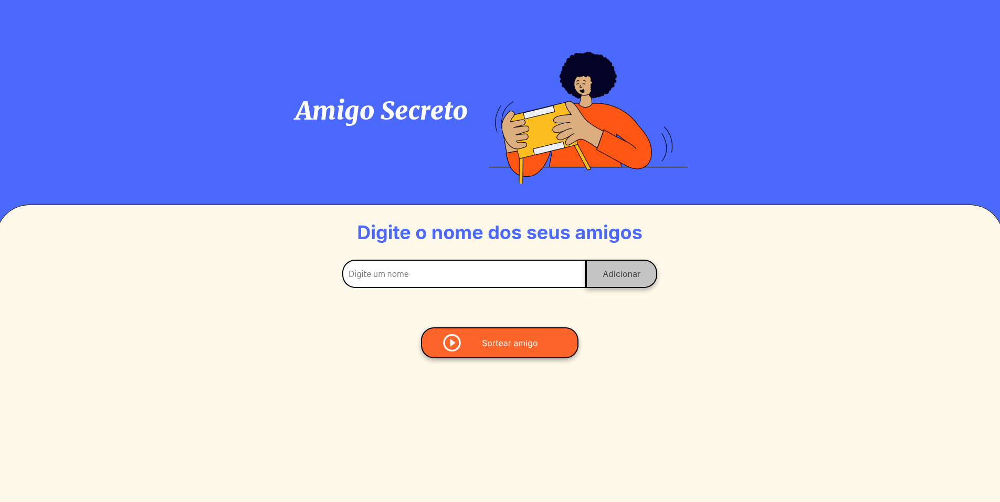

# PROJETO CHALLENGE AMIGO SECRETO_PT-MAIN ALURA-ONE

## O OBJETIVO DESTE PROJETO:
###  DESENVOLVER UM APP DE SORTEIO DE AMIGO SECRETO

### OBJETIVO DO APP

#### INSTRUÇÕES DE USO DO APP:
- O USUÁRIO  ACESSA O APP
- USUÁRIO DIGITA NOME DE UMA PESSOA A SER SORTEADA
- CLICAR EM ADICIONAR
- O USUÁRIO IRÁ REPETIR A AÇÃO ATÉ QUE ADICIONE TODOS OS AMIGOS/PARTICIPANTES
- CLICAR EM SORTEAR AMIGO
- O APP IRÁ EXIBIR NA TELA O NOME DO AMIGO SECRETO

#### COM O QUE FOI CONSTRUIDO

  

  

  

  

LINK DO PROJETO:
